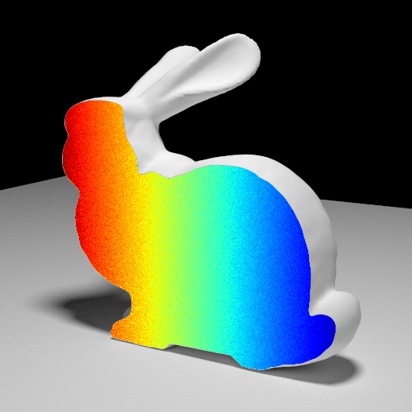

Walk-on-Boundary on PBRTv3
--------------------------

This is an extension of PBRT version 3 that implements our SIGGRAPH NA 2023 paper,
[*A Practical Walk-on-Boundary Method for Boundary Value Problems*](https://rsugimoto.net/WoBforBVPsProject/) by Sugimoto, Chen, Jiang, Batty, and Hachisuka.
Specifically, this is the codebase used to generate the figure featured in section 5.3, *WoB within MC rendering*.
This codebase only implements a solver for the interior Dirichlet problem.



## Directory structure

All of the relevant extension code is contained within the `src/wob` subfolder. In particular:

- `wob.cpp` and `wob.h`: Main implementation of the extension through the `WobIntegrator` class (specifically `WoBIntegrator::Li`)
- `scenes`: Example scenes used in rendering. The figure in the paper used the bunny scene.
- `thirdparty`: Dependency libraries

Additional modifications were made to `src/core/api.cpp` to integrate the new `WoBIntegrator` class,
`src/core/film.h` to expose private methods,
`src/core/geometry.h` to fix zero vector normalization,
and `src/core/integrator.h` to disable negative luminance checks.

## Dependencies

### C++ dependencies

As with base PBRT, C++ dependencies are included as git submodules.

    git clone --recurse-submodules https://github.com/tyxchen/WoBonPBRTv3.git

There is only one external C++ dependency:

- [tinycolormap](https://github.com/yuki-koyama/tinycolormap): a header-only library for colormaps

### Python dependencies

Running the turnkey render script (as described below) requires the following:

- Python 3.9+
- matplotlib
- numpy
- pandas

## Building and rendering

```
mkdir build
cd build
cmake -DCMAKE_BUILD_TYPE=Release ..
make pbrt_exe
```

Due to how PBRT is architected, the solution must be rendered separately from the scene;
the separate renders must then be composited to produce the final image.
To render and composite the bunny example:

    python3 render.py src/wob/scenes/bunny.pbrt --pbrt build/pbrt --render-scene

This will produce the following files:

- `bunny.png`: the interior solution as rendered by PBRT
- `bunny.png.mask`: a mask file for compositing
- `bunny.png.txt`: the raw numerical solution as rendered by PBRT
- `bunny-scene.png`: the rendered background scene
- `bunny-plt.png`: the final composited image

Subsequent runs can skip rendering the background scene by removing the `--render-scene` flag.

## Credits

PBRT version 3 is released by Matt Pharr, Wenzel Jacob, and Greg Humphreys under the BSD license.

The watertight Stanford Bunny model included in this repository is courtesy of Christopher Batty.
